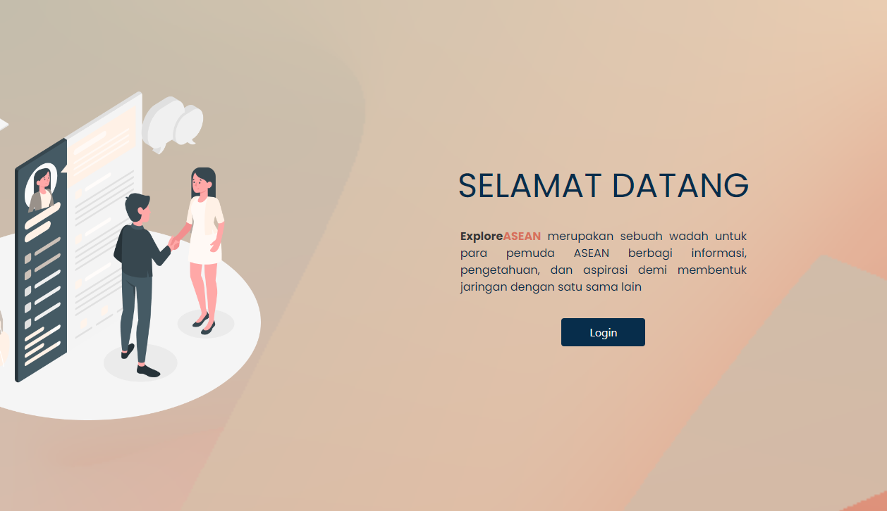

# Final Project - FEBE-27

## ASEAN Youth Forum

ASEAN Youth Forum (AYF) adalah gerakan yang mewakili dan memperjuangkan anak muda di ASEAN untuk menyuarakan keprihatinan dan strategi mereka untuk mencapai ASEAN yang lebih baik. AYF telah menjadi platform pemuda di ASEAN untuk menyuarakan dan menuntut hak-hak mereka untuk komunitas regional yang berkelanjutan, inklusif, berpusat pada orang, dan digerakkan oleh pemuda. Jaringan tersebut bertujuan untuk melembagakan dan mendirikan cabang-cabang nasionalnya untuk memfokuskan keterlibatan pada isu-isu lokal yang penting dan relevan yang mempengaruhi kaum muda dan mengkonsolidasikan proposal dan agenda kebijakan untuk diajukan ke kantor-kantor ASEAN yang relevan. Karena fokus kami adalah pada kaum muda, kami tidak memiliki 1 tujuan SDG spesifik yang kami prioritaskan.

## Isu

Zaman yang sudah berubah dengan adanya internet membuat perubahan alur informasi menjadi semakin cepat, alur informasi yang cepat berlalu membuat informasi yang beredar beraneka ragam.

Tak jarang pula informasi hoaks tersebar dengan banyak. Sehingga pemuda membutuhkan sebuah forum untuk berdiskusi.

## Solusi

Dari permasalahan sebelumnya, kami membuat sebuah website atau aplikasi _**(Explore ASEAN)**_ yang dapat digunakan untuk saling berdiskusi, yang membahas berbagai macam masalah dan berbagi pengalaman.

## Team Members

| Name                     | Role              | GitHub URL                                                         |
| ------------------------ | ----------------- | ------------------------------------------------------------------ |
| Anisah                   | Frontend          | [@anisahanisa](https://github.com/anisahanisa)                     |
| Cynthia Paramitha Putri  | Frontend          | [@cynthiaparamithaputri](https://github.com/cynthiaparamithaputri) |
| Deva Aditya Octavian     | Frontend          | [@devaaditya28](https://github.com/devaaditya28)                   |
| Asyam Faiq               | Backend           | [@asyamfaiq](https://github.com/asyamfaiq)                         |
| Bobby Pratama            | Backend           | [@Bobby-P-dev](https://github.com/Bobby-P-dev)                     |
| Muhammad Rezieq Fadillah | Backend           | [@RezieqFadillah](https://github.com/RezieqFadillah)               |

## Links

### BRD

[https://whimsical.com/febe-27-NBKta1FDExKfvZVevrf6fQ](https://whimsical.com/febe-27-NBKta1FDExKfvZVevrf6fQ)

### Userflow

[https://whimsical.com/user-flow-WutUWR3wbzCHLbV8wGK6qT](https://whimsical.com/user-flow-WutUWR3wbzCHLbV8wGK6qT)

### Wireframe

[https://whimsical.com/wireframe-L8V6ZpFjPmZ1fmukeVQqKK](https://whimsical.com/wireframe-L8V6ZpFjPmZ1fmukeVQqKK)

### Production

[http://asean-explore.netlify.app](http://asean-explore.netlify.app)

